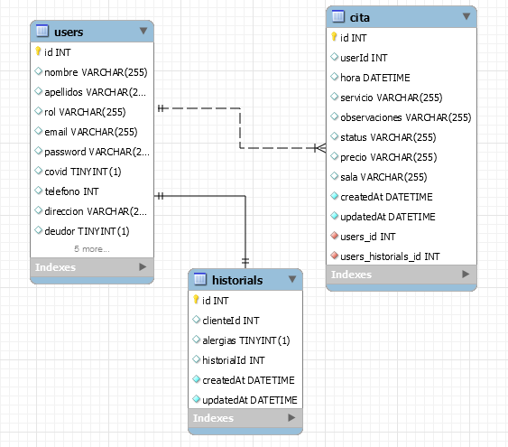

# clinica_dental
Proyecto creado en backend con NodeJS y Express con Sequelize.

**1 - Introducción:** 

Sistema de gestión de citas para una clínica dental que permite a un usuario registrarse, hacer login y logout para acceder a su área de cliente.

El usuario puede ver una lista de las visitas realizadas y las citas que tiene en un futuro.
Puede también anular una cita en concreto.

**2 - Descripción:**

* Endpoint para registro de usuarios.
* Endpoint para login de usuarios.
* Endpoint para logout de usuarios.
* Endpoint para listado de citas pendientes.
* Endpoint para eliminación de una cita.
* Endpoint para creación de una cita nueva. 

**3 - Diagrama tablas en workbench:**

